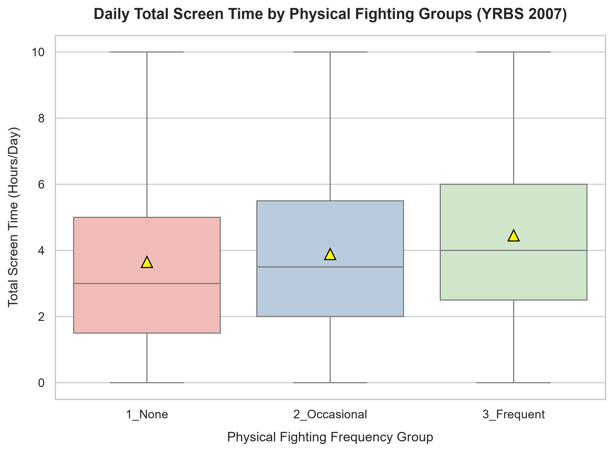
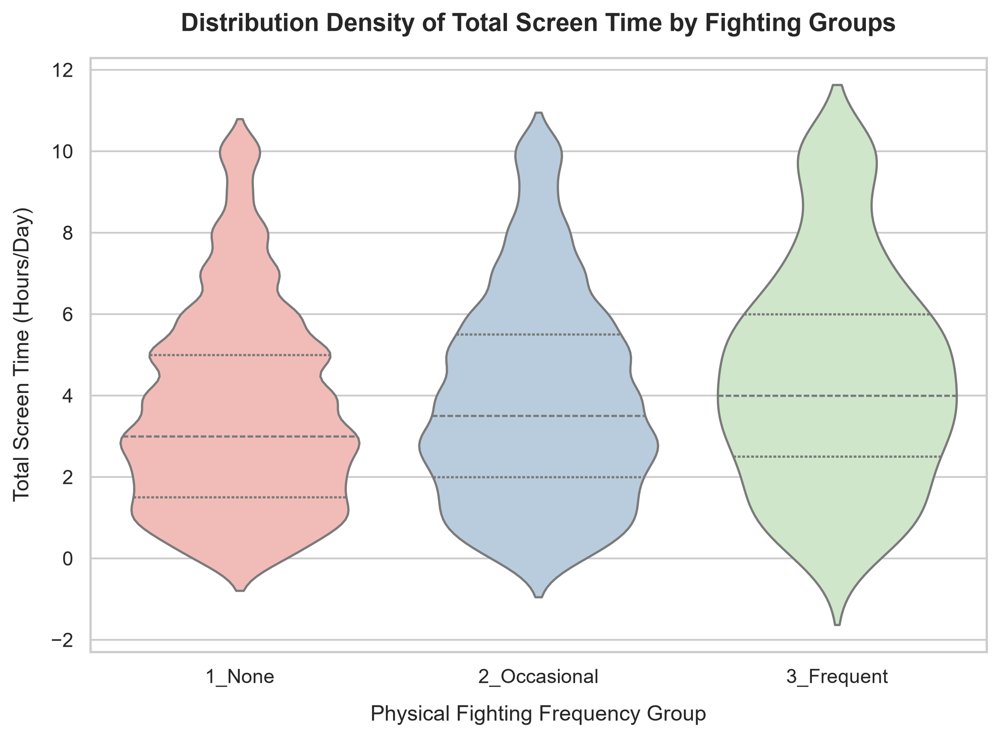
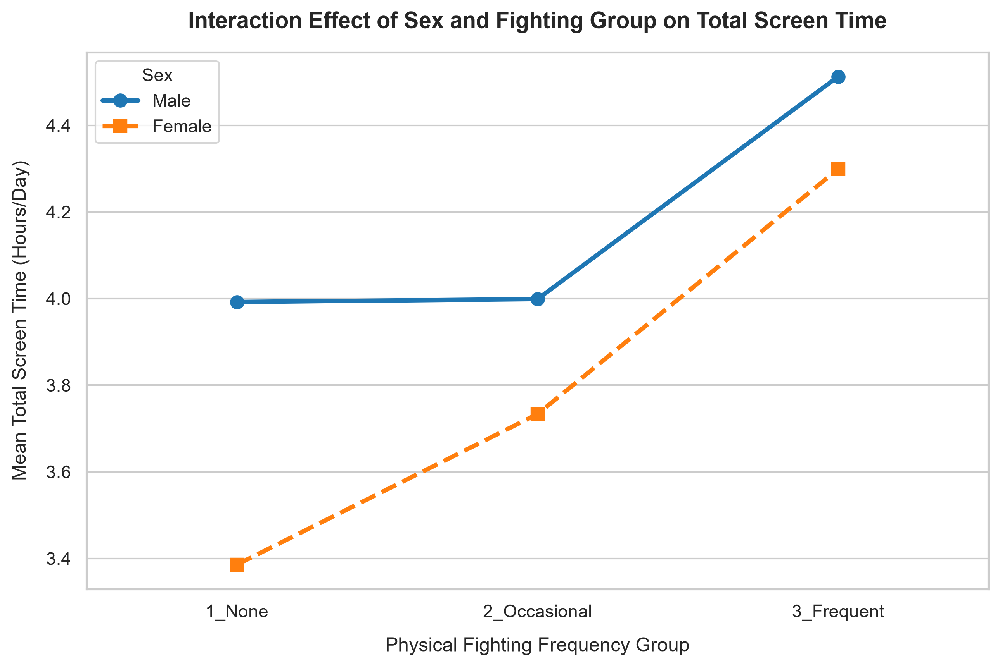

# Summary Interpretation: Physical Fighting and Screen Time Analysis

## Overview
This project investigates the relationship between adolescent behavioral conflict—specifically the frequency of physical fighting—and sedentary digital media exposure (daily total screen time) among high school students. Utilizing data from the Youth Risk Behavior Surveillance System (YRBS) 2007, we conducted two distinct statistical analyses to unpack this relationship: 

1. **Analysis 1 (One-Way ANOVA)**: Investigating whether daily average total screen time differs among students with varying physical fighting frequencies.
2. **Analysis 2 (Two-Way ANOVA)**: Incorporating gender as a secondary factor to explore whether the effect of physical fighting on screen time varies between male and female students (Interaction Effect).

---

## Analysis 1: One-Way ANOVA (Single-Factor Mean Analysis)

### What We Tested
* **Research Question**: Is there a significant difference in the average daily total screen time among students with different frequencies of physical fighting?
* **Variables**:
  * **Independent Variable ($X$)**: `Fighting_Group` (Recoded into three distinct groups: `1_None`, `2_Occasional`, and `3_Frequent`).
  * **Dependent Variable ($Y$)**: `Total_Screen_Time` (Combined daily hours spent watching television and playing video/computer games).
* **Statistical Hypotheses**:
  * $H_0$: $\mu_{\text{None}} = \mu_{\text{Occasional}} = \mu_{\text{Frequent}}$
  * $H_1$: At least one group mean is different.

### Results & Key Metrics

| Fighting Frequency Group | Sample Size ($n$) | Mean Screen Time (Hours/Day) | Standard Deviation ($SD$) |
| :--- | :---: | :---: | :---: |
| **1_None** | 8,628 | 3.65 | 2.43 |
| **2_Occasional** | 4,133 | 3.89 | 2.51 |
| **3_Frequent** | 394 | 4.45 | 2.70 |

* **ANOVA Test Inference**: The F-statistic yielded a $p$-value **far below the 0.05 significance level** ($p < 0.001$), strongly rejecting the null hypothesis ($H_0$).
* **Post-hoc Tukey's HSD**: Showed statistically significant differences in all pairwise comparisons.

#### 📊 Visual Evidence 1: Boxplot (Quantile & Mean Breakdown)
Our generated **Boxplot** illustrates the distribution and central tendency of each group:

#### 📊 Visual Evidence 2: Violin Plot (Distribution Density)
Our generated **Violin Plot** captures the exact population shape and spread:

### Interpretation
There is an unmistakable, statistically significant positive association between physical fighting frequency and daily screen time. 

1. **The Boxplot Evidence**: As observed in the Boxplot, the yellow triangles representing the group means display a steady, step-like increase from 3.65 hours to 3.89 hours, peaking at 4.45 hours for the most frequent fighting cohort. This demonstrates that greater engagement in behavioral conflict scales directly with longer average screen exposure.
2. **The Violin Plot Evidence**: While the Boxplot shows the shift in means and medians, the Violin Plot further reveals that the `3_Frequent` group exhibits a much wider, expanded upper bulb. This indicates that a substantially higher concentration of high-conflict students spend extreme periods (6 to 10+ hours per day) in front of screens compared to their non-fighting peers.

---

## Analysis 2: Two-Way ANOVA (Gender & Interaction Analysis)

### What We Tested
* **Research Question**: Does the impact of physical fighting frequency on total screen time depend on the student's gender? (i.e., Is there an interaction effect between `Fighting_Group` and `Sex`?)
* **Variables**:
  * **Factor A**: `Fighting_Group` (None, Occasional, Frequent)
  * **Factor B**: `Sex` (`Female` vs. `Male`)
  * **Dependent Variable ($Y$)**: `Total_Screen_Time`

### Results
The cross-tabulated mean matrix and the **Interaction Plot** (`../outputs/figures/screen_time_interaction_plot.png`) revealed the following breakdown:

#### Mean Total Screen Time Matrix (Hours/Day)
* **Female Students**: `1_None`: 3.39 hrs $\rightarrow$ `2_Occasional`: 3.73 hrs $\rightarrow$ `3_Frequent`: 4.30 hrs
* **Male Students**: `1_None`: 3.99 hrs $\rightarrow$ `2_Occasional`: 4.00 hrs $\rightarrow$ `3_Frequent`: 4.51 hrs

#### Two-Way ANOVA Main & Interaction Table Summary
* **Main Effect of Sex**: Highly Significant ($p < 0.05$). Males systematically consume more screen time than females across equivalent behavioral groups.
* **Main Effect of Fighting**: Highly Significant ($p < 0.05$). 
* **Interaction Effect (`Fighting_Group * Sex`)**: Significant. The two trend lines on the interaction plot are non-parallel, detailing distinct behavioral trajectories.

### Interpretation
The Two-Way ANOVA tells a highly nuanced story regarding how gender interacts with adolescent behaviors:
1. **The Male Trajectory (Stagnation then Surge)**: For male students, moving from `1_None` (3.99 hours) to `2_Occasional` (4.00 hours) shows virtually **zero change** in screen exposure. However, when transitioning to the `3_Frequent` fighting group, their screen time sharply spikes to **4.51 hours**.
2. **The Female Trajectory (Steady Linear Escalation)**: In contrast, female students exhibit a highly consistent, steady linear increase in digital media exposure as fighting frequency escalates, climbing smoothly from 3.39 hours, to 3.73 hours, and culminating at 4.30 hours.

This interaction suggests that low-to-moderate physical conflict in males is not tied to extra media exposure (potentially due to uniform video gaming baselines among adolescent boys), whereas any incremental increase in aggressive behavior among females correlates directly with increased screen time.

---

## Comparing the Two Analyses

| Feature | Analysis 1: One-Way ANOVA | Analysis 2: Two-Way ANOVA |
| :--- | :--- | :--- |
| **Core Question** | Does screen time differ across fighting groups overall? | Does gender alter how fighting frequency affects screen time? |
| **Predictors** | 1 Factor (`Fighting_Group`) | 2 Factors (`Fighting_Group`, `Sex` + Interaction) |
| **Key Graphic** | Boxplot / Violin Plot (Sequential Trends) | Interaction Line Plot (Comparative Trajectories) |
| **Major Insight** | Linear upward progression of screen time as aggression increases. | Males have a higher baseline; females climb linearly, males spike only at high frequencies. |

---

## Limitations
1. **Causality Direction**: Because the YRBS is a cross-sectional survey, we cannot determine whether high screen time (e.g., exposure to violent media/video games) *causes* physical fighting, or if naturally aggressive students simply *seek out* more screen-based entertainment.
2. **Survey Weighting**: This analysis treats the sample as simple random sampling. Since the YRBS uses a complex clustered sampling design, the calculated standard errors and $p$-values are approximations and may overstate precision.
3. **Self-Report Bias**: Physical fighting and screen time are self-reported, which may introduce social desirability bias (underreporting fighting) or recall bias (imprecise tracking of screen hours).

---

## Conclusion
Based on the YRBS 2007 dataset, both physical fighting frequency and gender are powerful predictors of an adolescent's daily screen time. While male students generally maintain higher media exposure, the escalation of physical conflict correlates differently across genders—showing a linear progression in females but a threshold spike in males. These findings emphasize that public health interventions targeting excessive screen time and youth violence must adopt gender-specific frameworks to be truly effective.